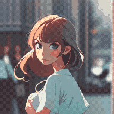
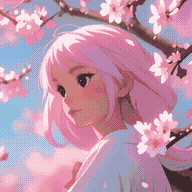
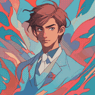
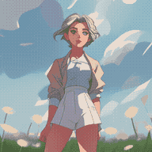
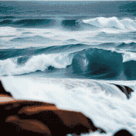
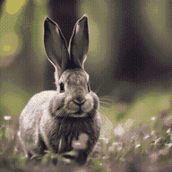
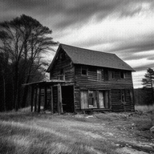

# 启动服务器


1. 创建env，存放阿里云oss环境变量，当你的图算好后会上传

env:
```
OSS_REGION="哈哈哈哈，哈哈哈哈哈"
OSS_ACCESS_KEY_ID="哈哈哈哈，哈哈哈哈哈"
OSS_ACCESS_KEY_SECRET="哈哈哈哈，哈哈哈哈哈"
OSS_BUCKET="哈哈哈哈，哈哈哈哈哈"
OSS_ENDPOINT="哈哈哈哈，哈哈哈哈哈"
```

2. 启动服务器（假装你已经做好原作者要求做的所有事情了
```
uvicorn main:app --host 0.0.0.0 --port 6006 --reload
<!-- 或是后台运行 -->
nohup uvicorn main:app --host 0.0.0.0 --port 6006 --reload > server.log 2>&1 &

```

# API

路径：/text2gif

方法：POST

说明：定义ckpt、lora、prompt等参数，返回任务ID，当图片生成后，可以通过给定的url访问图片。

请求体：
```json
{
    // CKPT
    "base": "models/DreamBooth_LoRA/AnythingV5_v5PrtRE.safetensors",
    // LORA
    "path": "models/DreamBooth_LoRA/genshinimpact_kirara_v2.safetensors",
    "additional_networks": [
        "models/DreamBooth_LoRA/LineLine2D.safetensors : 0.7"
    ],
    // 基图，可选
    "init_image_url": "https://oss.talesofai.cn/picture/e51d0ca9-a924-49f2-8ef1-b72cb738219e.jpeg",
    // 动态模型，只能选一个
    "motion_module": [
        "models/Motion_Module/mm_sd_v14.ckpt"
        // ,
        // "models/Motion_Module/mm_sd_v15.ckpt"
    ],
    "steps": 20,
    "guidance_scale": 7.5,
    "lora_alpha": 0.8,
    "seed": [],
    "prompt": [
        "best quality, masterpiece, kirara, 1girl, solo, green eyes, ahoge, hair ornament, light brown hair , happy , classroom,eating chocolate"
    ],
    "n_prompt": [
        "NSFW, lr, nsfw,(sketch, duplicate, ugly, huge eyes, text, logo, monochrome, worst face, (bad and mutated hands:1.3), (worst quality:2.0), (low quality:2.0), (blurry:2.0), horror, geometry, bad_prompt_v2, (bad hands), (missing fingers), multiple limbs, bad anatomy, (interlocked fingers:1.2), Ugly Fingers, (extra digit and hands and fingers and legs and arms:1.4), crown braid, ((2girl)), (deformed fingers:1.2), (long fingers:1.2),succubus wings,horn,succubus horn,succubus hairstyle, (bad-artist-anime), bad-artist, bad hand, grayscale, skin spots, acnes, skin blemishes"
    ],
    "random_seed": -1,
    // 帧数
    "L":16,
    // 长和宽（如果有基图，就不适用了）
    "W":512,
    "H":512
}
```

响应体示例：
```json
{
    "message": "Text to GIF conversion started, once the task completed , you can access https://oss.talesofai.cn/internal/gif/8bc26b34-b030-4912-aacb-784ea30de97e.gif",
    "task_id": "8bc26b34-b030-4912-aacb-784ea30de97e"
}
```


以下是AnimateDiff项目的原文⬇️


# AnimateDiff

This repository is the official implementation of [AnimateDiff](https://arxiv.org/abs/2307.04725).

**[AnimateDiff: Animate Your Personalized Text-to-Image Diffusion Models without Specific Tuning](https://arxiv.org/abs/2307.04725)**
</br>
Yuwei Guo,
Ceyuan Yang*,
Anyi Rao,
Yaohui Wang,
Yu Qiao,
Dahua Lin,
Bo Dai

<p style="font-size: 0.8em; margin-top: -1em">*Corresponding Author</p>

[Arxiv Report](https://arxiv.org/abs/2307.04725) | [Project Page](https://animatediff.github.io/)

## Todo
- [x] Code Release
- [x] Arxiv Report
- [x] GPU Memory Optimization
- [ ] Gradio Interface

## Setup for Inference

### Prepare Environment
~~Our approach takes around 60 GB GPU memory to inference. NVIDIA A100 is recommanded.~~

***We updated our inference code with xformers and a sequential decoding trick. Now AnimateDiff takes only ~12GB VRAM to inference, and run on a single RTX3090 !!***

```
git clone https://github.com/guoyww/AnimateDiff.git
cd AnimateDiff

conda env create -f environment.yaml
conda activate animatediff
```

### Download Base T2I & Motion Module Checkpoints
We provide two versions of our Motion Module, which are trained on stable-diffusion-v1-4 and finetuned on v1-5 seperately.
It's recommanded to try both of them for best results.
```
git lfs install
git clone https://huggingface.co/runwayml/stable-diffusion-v1-5 models/StableDiffusion/

bash download_bashscripts/0-MotionModule.sh
```
You may also directly download the motion module checkpoints from [Google Drive](https://drive.google.com/drive/folders/1EqLC65eR1-W-sGD0Im7fkED6c8GkiNFI?usp=sharing), then put them in `models/Motion_Module/` folder.

### Prepare Personalize T2I
Here we provide inference configs for 6 demo T2I on CivitAI.
You may run the following bash scripts to download these checkpoints.
```
bash download_bashscripts/1-ToonYou.sh
bash download_bashscripts/2-Lyriel.sh
bash download_bashscripts/3-RcnzCartoon.sh
bash download_bashscripts/4-MajicMix.sh
bash download_bashscripts/5-RealisticVision.sh
bash download_bashscripts/6-Tusun.sh
bash download_bashscripts/7-FilmVelvia.sh
bash download_bashscripts/8-GhibliBackground.sh
bash download_bashscripts/9-AdditionalNetworks.sh
```

### Inference
After downloading the above peronalized T2I checkpoints, run the following commands to generate animations. The results will automatically be saved to `samples/` folder.
```
python -m scripts.animate --config configs/prompts/1-ToonYou.yaml
python -m scripts.animate --config configs/prompts/2-Lyriel.yaml
python -m scripts.animate --config configs/prompts/3-RcnzCartoon.yaml
python -m scripts.animate --config configs/prompts/4-MajicMix.yaml
python -m scripts.animate --config configs/prompts/5-RealisticVision.yaml
python -m scripts.animate --config configs/prompts/6-Tusun.yaml
python -m scripts.animate --config configs/prompts/7-FilmVelvia.yaml
python -m scripts.animate --config configs/prompts/8-GhibliBackground.yaml
python -m scripts.animate --config configs/prompts/9-AdditionalNetworks.yml
```

To generate animations with a new DreamBooth/LoRA model, you may create a new config `.yaml` file in the following format:
```
NewModel:
  path: "[path to your DreamBooth/LoRA model .safetensors file]"
  base: "[path to LoRA base model .safetensors file, leave it empty string if not needed]"

  motion_module:
    - "models/Motion_Module/mm_sd_v14.ckpt"
    - "models/Motion_Module/mm_sd_v15.ckpt"
    
  steps:          25
  guidance_scale: 7.5

  prompt:
    - "[positive prompt]"

  n_prompt:
    - "[negative prompt]"
```
Then run the following commands:
```
python -m scripts.animate --config [path to the config file]
```

## Gallery
Here we demonstrate several best results we found in our experiments.

<table class="center">
    <tr>
    <td></td>
    <td></td>
    <td></td>
    <td></td>
    </tr>
</table>
<p style="margin-left: 2em; margin-top: -1em">Model：<a href="https://civitai.com/models/30240/toonyou">ToonYou</a></p>

<table>
    <tr>
    <td></td>
    <td></td>
    <td></td>
    <td></td>
    </tr>
</table>
<p style="margin-left: 2em; margin-top: -1em">Model：<a href="https://civitai.com/models/4468/counterfeit-v30">Counterfeit V3.0</a></p>

<table>
    <tr>
    <td></td>
    <td></td>
    <td></td>
    <td></td>
    </tr>
</table>
<p style="margin-left: 2em; margin-top: -1em">Model：<a href="https://civitai.com/models/4201/realistic-vision-v20">Realistic Vision V2.0</a></p>

<table>
    <tr>
    <td></td>
    <td></td>
    <td></td>
    <td></td>
    </tr>
</table>
<p style="margin-left: 2em; margin-top: -1em">Model： <a href="https://civitai.com/models/43331/majicmix-realistic">majicMIX Realistic</a></p>

<table>
    <tr>
    <td></td>
    <td></td>
    <td></td>
    <td></td>
    </tr>
</table>
<p style="margin-left: 2em; margin-top: -1em">Model：<a href="https://civitai.com/models/66347/rcnz-cartoon-3d">RCNZ Cartoon</a></p>

<table>
    <tr>
    <td></td>
    <td></td>
    <td></td>
    <td></td>
    </tr>
</table>
<p style="margin-left: 2em; margin-top: -1em">Model：<a href="https://civitai.com/models/33208/filmgirl-film-grain-lora-and-loha">FilmVelvia</a></p>

### Longer generations
You can also generate longer animations by using overlapping sliding windows.
```
python -m scripts.animate --config configs/prompts/{your_config}.yaml --L 64 --context_length 16 
```
##### Sliding window related parameters:

```L``` - the length of the generated animation.

```context_length``` - the length of the sliding window (limited by motion modules capacity), default to ```L```.

```context_overlap``` - how much neighbouring contexts overlap. By default ```context_length``` / 2

```context_stride``` - (2^```context_stride```) is a max stride between 2 neighbour frames. By default 0

##### Extended this way gallery examples

<table class="center">
    <tr>
    <td></td>
    <td></td>
    <td></td>
    <td></td>
    </tr>
</table>
<p style="margin-left: 2em; margin-top: -1em">Model：<a href="https://civitai.com/models/30240/toonyou">ToonYou</a></p>

<table>
    <tr>
    <td></td>
    <td></td>
    <td></td>
    <td></td>
    </tr>
</table>
<p style="margin-left: 2em; margin-top: -1em">Model：<a href="https://civitai.com/models/4201/realistic-vision-v20">Realistic Vision V2.0</a></p>

#### Community Cases
Here are some samples contributed by the community artists. Create a Pull Request if you would like to show your results here😚.

<table>
    <tr>
    <td></td>
    <td></td>
    <td></td>
    <td></td>
    <td></td>
    </tr>
</table>
<p style="margin-left: 2em; margin-top: -1em">
Character Model：<a href="https://civitai.com/models/13237/genshen-impact-yoimiya">Yoimiya</a> 
(with an initial reference image, see <a href="https://github.com/talesofai/AnimateDiff">WIP fork</a> for the extended implementation.)


<table>
    <tr>
    <td></td>
    <td></td>
    <td></td>
    <td></td>
    </tr>
</table>
<p style="margin-left: 2em; margin-top: -1em">
Character Model：<a href="https://civitai.com/models/9850/paimon-genshin-impact">Paimon</a>;
Pose Model：<a href="https://civitai.com/models/107295/or-holdingsign">Hold Sign</a></p>

## BibTeX
```
@misc{guo2023animatediff,
      title={AnimateDiff: Animate Your Personalized Text-to-Image Diffusion Models without Specific Tuning}, 
      author={Yuwei Guo, Ceyuan Yang, Anyi Rao, Yaohui Wang, Yu Qiao, Dahua Lin, Bo Dai},
      year={2023},
      eprint={2307.04725},
      archivePrefix={arXiv},
      primaryClass={cs.CV}
}
```

## Contact Us
**Yuwei Guo**: [guoyuwei@pjlab.org.cn](mailto:guoyuwei@pjlab.org.cn)  
**Ceyuan Yang**: [yangceyuan@pjlab.org.cn](mailto:yangceyuan@pjlab.org.cn)  
**Bo Dai**: [daibo@pjlab.org.cn](mailto:daibo@pjlab.org.cn)

## Acknowledgements
Codebase built upon [Tune-a-Video](https://github.com/showlab/Tune-A-Video).